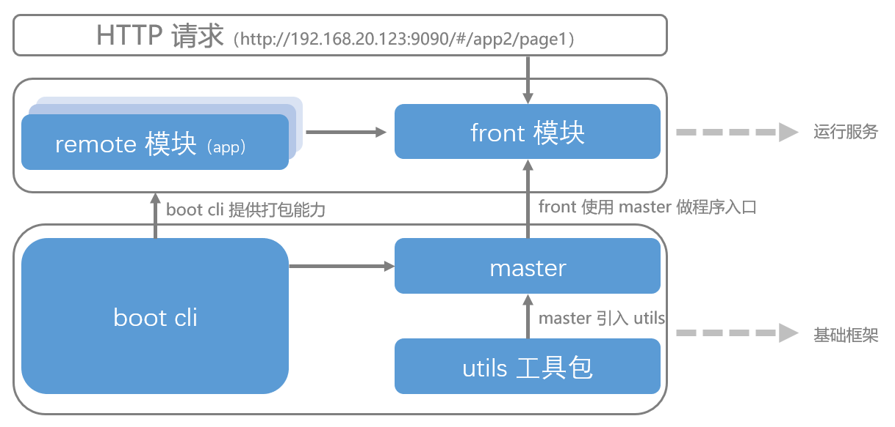
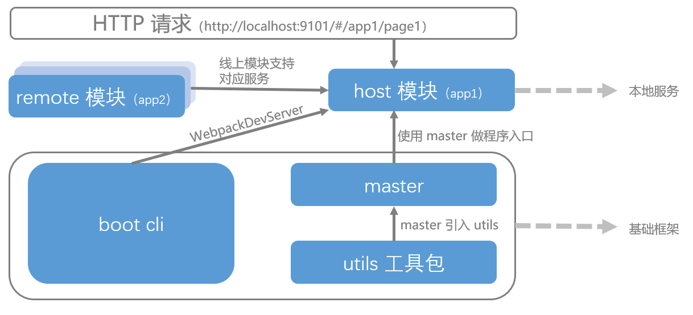
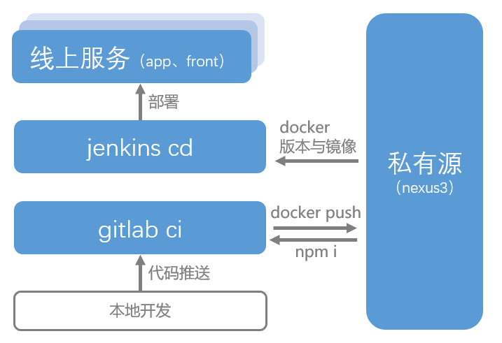

# microup 微前端框架

## 简介

使用 microup 可快速搭建一套微前端项目，前端框架代码仅基于 webapck 5 的模块联邦（Module Federation）实现，并没有其他过的冗余封装。代码 clone 后稍加修改就可以部署使用。

框架下，每个前端 remote 模块都可以独立开发部署，实现了 service-worker 缓存静态文件加快项目首屏加载。此外，还有全套的运维部署的实现方案，包含 gitlab 安装以及 gitlab-ci 实现方案、Nexus3 私有源搭建使用方案、jenkins 安装以及 CI/CD 实现方案。

**线上运行时项目架构**

线上部署后，请求访问统一从 front 服务进入，然后 front 模块按照一级路由获取不同的 remote 模块的服务能力。



**本地开发时项目架构**

本地开发一个模块时，这个模块会成为 host 模块，它会连接线上模块，线上的所有 remote 模块都可以给予服务支持。

> 您也可以本地运行多个模块，进行联调开发，只需要设置 .env 文件即可，详情查看 app1 包的 README.md 介绍。



## 运行demo

克隆项目到本地

```
git clone
```

给 app1 模块添加 app2 访问地址，进入 /app1/react/.env 中

```bash
# 添加下边一行，当我们访问 app2 模块时就可以读取这个微服务的内容了
app2=http://localhost:9102
```

然后修改 app1 和 app2 的 .npmrc 文件中的 registry 为 https://registry.npmjs.org/ （由于还没有搭建私有源，先用线上的 boot 包做一下测试）

然后安装依赖包（推荐使用 pnpm 做包管理工具）

```bash
# app1 目录下安装依赖
pnpm i
# app2 目录下安装依赖
pnpm i
```

然后运行 app1 和 app2

```bash
# app1 目录下 start
pnpm run start
# app2 目录下 start
pnpm run start
```

访问 app1 的本地服务地址，默认为：http://localhost:9101。

## 如何线上使用

ci/cd基本流程



### **如果您已有 gitlab 和 jenkins 以及 Nexus3 的服务**。

您只需要 clone 代码，然后按照教程添加几个 jenkins 任务，添加几个环境变量即可部署完成。

详细如下：

进入 gitlab 服务，建议您创建一个项目组，然后在项目组内添加几个环境变量，这些变量在跑 ci 时会用的到。

```js
DOCKER_PRIVATE_URL // docker 私有源的地址。例如：`192.168.20.101:8086`

NEXUS_USER_BASE64 // 用于登录私有源的密钥（暂时设为空即可）。

NEXUS_USER_NAME // 私有源登录的用户名。

NEXUS_USER_PASE // 私有源登录的密码。

NPM_GROUP_URL // npm 私有源 install 地址。例如：`http://192.168.20.101:8082/repository/npm-group/`

NPM_PRIVATE_URL // npm 私有源 publish 地址。例如：`http://192.168.20.101:8082/repository/npm-private/`
```

然后克隆代码

```
git clone
```

首先推送 utils 包到您 gitlab 刚刚新建的项目组中，等待 ci 跑完。

> utils 包是整个项目公用的组件包，项目内所有的 remote 模块（例如 app1 服务）都可以访问到。
>
> utils ci 的 build 阶段会推送代码到私有源（详情可查看`cicd_readme/gitlab 部署`中的README.md。）

utils ci 跑完后，然后推送 boot 到 gitlab 项目组中，等待 ci 跑完。

> boot 是整个项目下属的每个 remote 模块（例如 app1 服务）的打包工具，它打出的包可以实现[动态容器](https://www.webpackjs.com/concepts/module-federation/#dynamic-remote-containers)远程访问（详情参考 boot 包中的文档介绍），实现 remote 模块的连接。
>
> boot ci 中会执行 npm i 拉取 NPM_GROUP_URL 私有源中的包，这个私有源要能找到 utils ci后的包（私有源搭建详情可查看`cicd_readme/Nexus3 部署`中的README.md。）

boot ci 跑完后，然后推送 master 到 gitlab 项目组中，等待 ci 跑完。

> master 是项目内所有 remote 模块（例如 app1 服务）代码的入口，负责项目总的状态管理，remote 模块间通信等工作。
>
> master ci 会拉取 utils 和 boot 的打出包。

然后推送 front 、 app1 、app2 包到 gitlab 项目组中，等待 ci 跑完。

> front 、 app1 、app2 包每次 ci 跑完后都会生成一个 docker 镜像，这个docker 镜像继承 nginx ，部署后就是对应包的前端服务。

> ci 详情请查看`cicd_readme/gitlab 部署`中的README.md。

至此，ci 流程已经完成，下边我们部署这个项目到服务器。

**我们可以手动部署到服务器**

拉取刚刚 ci 跑完后打出的 docker 镜像（docker 镜像版本，可在 ci 控制台中查看）

```bash
docker pull 192.168.20.101:8086/app1-cd:1.0.0-main-1.0.0.20230822005859
```

运行这个 docker

```bash
docker run -d -p 9101:80 --name app1-cd 192.168.20.101:8086/app1-cd:1.0.0-main-1.0.0.20230822005859
```

然后访问 `http://服务器地址:9101/#/app1/page1` 即可访问。

**通过 jenkins 自动部署**

通过 jenkins 可以实现在任务部署界面中， docker 镜像按照时间逆序排列，展示微前端服务打包的所有镜像，可以手动选择一个镜像部署到服务器。

详情参考`cicd_readme/jenkins 部署`中的README.md。

### 如果还未安装 gitlab 和 jenkins 以及 Nexus3 的服务

如果还未安装 gitlab 和 jenkins 以及 Nexus3 的服务，请参考 cicd_readme 目录下 gitlab 配置、enkins 配置、Nexus3 配置的文档，里边有安装以及使用介绍。
