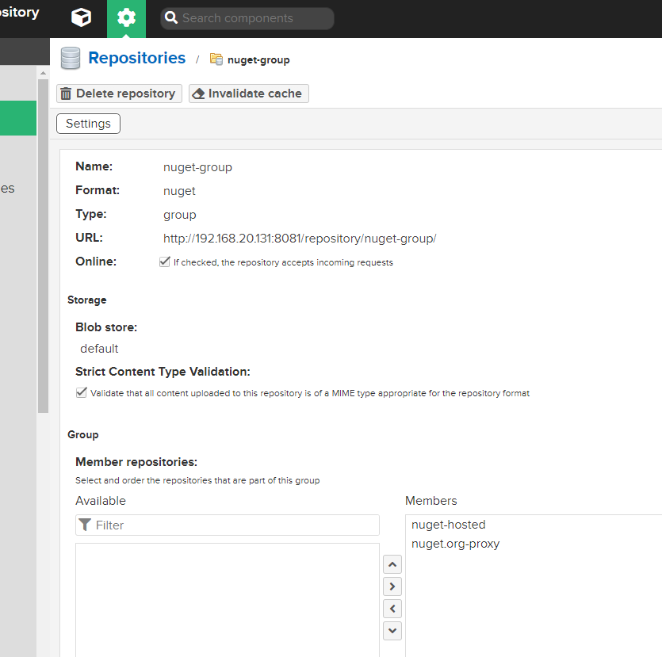
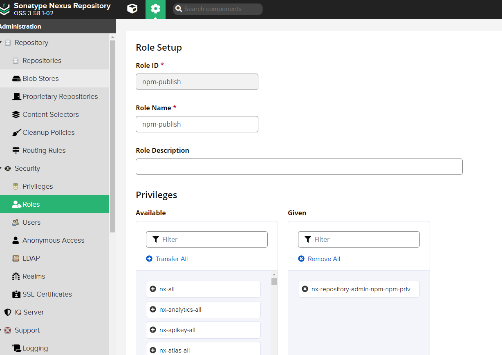
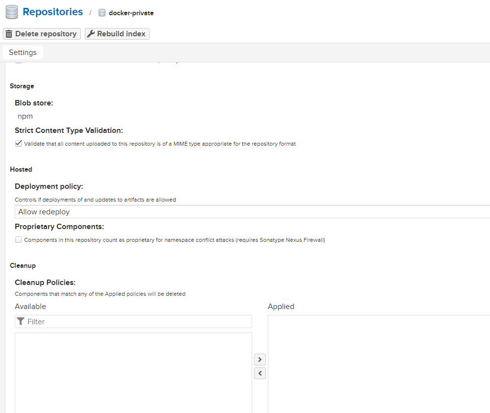

# Nexus3 私有源配置

建立私有源服务，主要用于 boot 和 master 包打出的 lib 存储，以及 ci 跑完后产出的 docker 镜像存储。

## 安装

下载对应的 docker

```bash
docker pull sonatype/nexus3:3.58.1
```

运行 docker

```bash
docker run -d -p 8081:8081 --network=host --name nexus sonatype/nexus3:3.58.1
# 设置端口为8081
# 设置使用宿主机的网络
```

## 建立npm私有库

### 新建 blob stores

用于文件的blob存储。

blob stores 相关文档：https://help.sonatype.com/repomanager3/nexus-repository-administration/repository-management/configuring-blob-stores


### 创建 Repositories

**单个源映射创建**

创建第一步 select recipe 选择 npm(proxy)

然后填入 name 和 remote storage


这里的 remote storage 填入源地址：

https://registry.npmjs.org	对应 npm

https://registry.npm.taobao.org	对应 cnpm

http://mirrors.cloud.tencent.com/npm/	对应 腾讯源

https://repo.huaweicloud.com/repository/npm/	对应 华为源

同样方法，可以分别创建四个。

**群组创建**

然后创建群组，用于打包上面四个映射，拉去包时，按照策略择优使用。

创建第一步 select recipe 选择 npm(group)

然后调整 Member repositories 顺序，最终创建



使用时，直接使用上边群组的地址作为源即可。

## NPM私有库上传

### 新建关系映射

新建关系映射，select recipe 选择 npm(hosted)

然后注意选择 Deployment policy 存储策略为 Disable redeploy

> 在使用 Nexus3 创建 Repositories 为 npm(hosted) 时，deployment policy 选项用于控制如何允许或禁止组件的部署。
>
> 一般选择 Disable Redeploy 原因在于用版本管理我们的包，所以只允许上传一次，下一次上传需要是新的版本。


然后创建完毕，我们打包时，注意**使用 npm-private 的地址**作为源（免费版不支持npm(group)作为上传的源）

### **创建用户与角色**

点击 roles 创建权限，选择 privileges 如下



创建用户


### **设置密码与打包**

然后项目内操作如下：

```bash
# 首先编码用户名密码用于登录
echo -n 'npm:123123' | base64
# "bnBtOi5XenhjdmJubTEyMw=="

# 然后设置 .npmrc
registry=http://192.168.20.123:8081/repository/npm-private/
//192.168.20.131:8081/repository/npm-private/:_auth="bnBtOi5XenhjdmJubTEyMw=="
# 检查校验 .npmrc
npm config fix
# 打包
npm publish
```

## DOCKER私有库上传

新建关系映射，select recipe 选择 docker(hosted)

注意不要勾选 Allow anonymous docker pull ( Docker Bearer Token Realm required )

然后 HTTP 写入 8089 （通过这个接口访问）




然后修改角色，搜索 docker-private-*


**服务器内添加配置**

进入需要用这些源的服务内，修改 docker 配置，使得 docker push 时，源为 `192.168.88.130:8089`

```bash
$ sudo vim /etc/docker/daemon.json
# 添加
  "registry-mirrors": [
        "http://192.168.88.130:8089/",
        "https://r4p7cmbk.mirror.aliyuncs.com",
        "https://8xpk5wnt.mirror.aliyuncs.com",
        "https://dockerhub.azk8s.cn",
        "https://registry.docker-cn.com",
        "https://ot2k4d59.mirror.aliyuncs.com/"
  ],
  "insecure-registries": [
    "192.168.88.130:8089"
  ],
# 重启服务
sudo systemctl daemon-reload
sudo systemctl restart docker
sudo systemctl reload docker.service
```

**操作**

push操作需要登录到私有源

> 注意 jenkins 服务器中使用的用户为 jenkins 用户，需要用jenkins用户登录到库，否则 pull 时报错。

```bash
# 登录远程库
docker login -u npm -p …… 192.168.88.130:8089
```

添加远程tag

```bash
docker tag app1-cd:1.0.0-main-1.0.0.20230823131634 192.168.88.130:8089/app1-cd:1.0.0-main-1.0.0.20230823131634
docker images # 查看是否添加成功
```

docker push

```bash
docker push 192.168.88.130:8089/app1-cd:1.0.0-main-1.0.0.20230823131634
```


