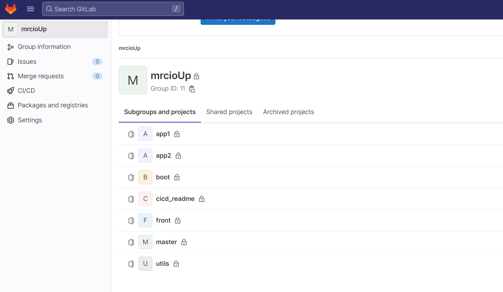
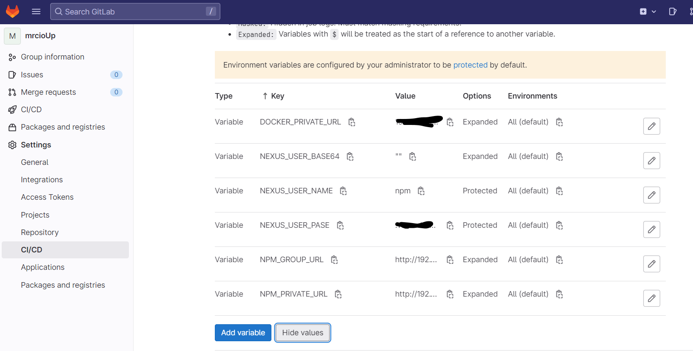
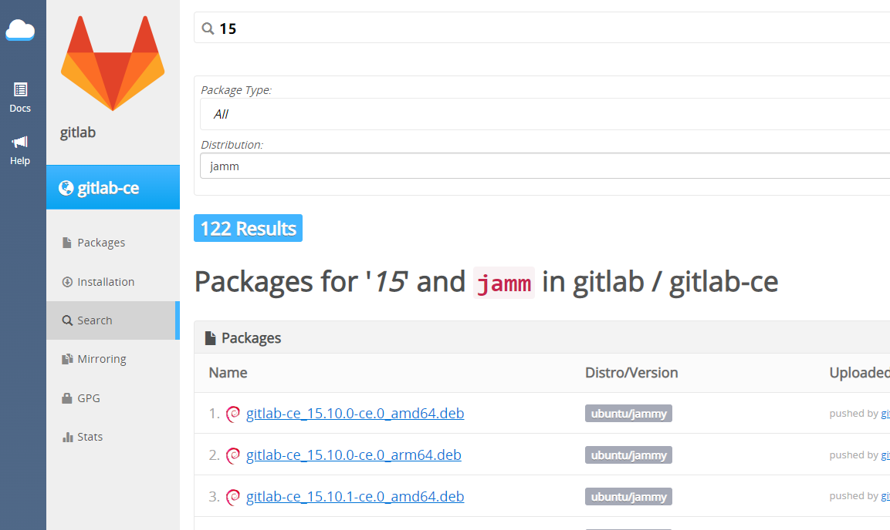
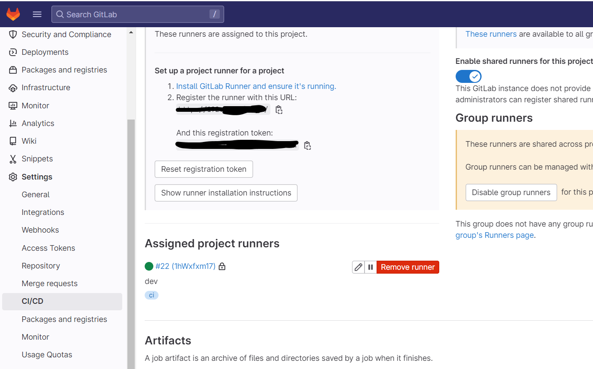

# gitlab 配置文档

gitlab 负责代码管理，用于多人开发时的协作工具。我们在 gitlab 中可以创建一个 group 放我们的整体项目，group 中在分别创建每个子项目，这样更容易管理我们的微前端项目。




## gitlab-ci 配置

### 全局常量

我们的项目创建时，可以创建所有项目到一个 group 内，这样我们在 group 中创建的全局常量，就都可以访问了。

添加常量：

DOCKER_PRIVATE_URL // docker 私有源的地址。例如：`192.168.20.101:8086`

NEXUS_USER_BASE64 // 用于登录私有源的密钥（暂时设为空即可）。

NEXUS_USER_NAME // 私有源登录的用户名。

NEXUS_USER_PASE // 私有源登录的密码。

NPM_GROUP_URL // npm 私有源 install 地址。例如：`http://192.168.20.101:8082/repository/npm-group/`

NPM_PRIVATE_URL // npm 私有源 publish 地址。例如：`http://192.168.20.101:8082/repository/npm-private/`



### boot、utils、master 的 ci 配置

boot、utils、master 这三个包不需要部署成服务，只需要 ci 跑完后上传到私有库，供 remote 模块消费。

**stage package-edit** 主要负责包的版本修改，为包的版本添加上时间扩展名，保证每次 ci 跑完后都会是独特不重复的。

例如：`"version": "1.0.0"` 修改后变为 `"version": "1.0.0-dev-1.0.0.20230820221849"`。

**stage build** 负责打包生成 lib ，然后 publish 到私有源。

更多 ci 配置项详情参考：https://docs.gitlab.com/ee/ci/yaml/。

```yml
stages:
  - package-edit
  - build

package-edit:
  image: exozet/jq:1.6-r0
  tags:
    - ci
  stage: package-edit
  script:
    - CURRENT_VERSION=$(jq -r .version package.json)
    - NEW_VERSION="${CURRENT_VERSION}-${CI_COMMIT_REF_NAME}-${CURRENT_VERSION}.$(date +%Y%m%d%H%M%S)"
    - jq ".version = \"${NEW_VERSION}\"" package.json > package.json.tmp && mv package.json.tmp package.json
  artifacts:
    paths:
      - $CI_PROJECT_DIR/package.json
  only:
    refs:
      - /^main-*$/
      - /^dev-*$/
      - main
      - dev

build:
  image: node:16.13.2
  tags:
    - ci
  stage: build
  script:
    - cat package.json
    - echo "开始 compile"
    - echo ${NEXUS_USER_NAME}
    - NEXUS_USER_BASE64=$(echo -n "${NEXUS_USER_NAME}:${NEXUS_USER_PASE}" | base64)
    - export NEXUS_USER_BASE64
    - echo "registry=${NPM_PRIVATE_URL}" > ~/.npmrc
    - echo "//${NPM_PRIVATE_URL##http*://}:_auth=${NEXUS_USER_BASE64}" >> ~/.npmrc
    - npm install --registry ${NPM_GROUP_URL} --loglevel verbose
    - chmod -R 755 .
    - npm run compile
    - echo "完成 compile"
    - echo ".npmrc 内容："
    - cat ~/.npmrc
    - echo "开始 pre-publish"
    - npm publish --no-git-checks --registry ${NPM_PRIVATE_URL}
    - echo "完成 pre-publish"
  dependencies:
    - package-edit
  only:
    refs:
      - /^main-*$/
      - /^dev-*$/
      - main
      - dev


```

### front、app 的 ci 配置

front、app 的包打包时，需要完成上边 boot、master、utils 的 ci 步骤的同时，还需要生成可以部署的 docker 源，然后 docker 源会上传到私有源内。

**stage docker-push** 负责生成一个 copy 项目目录下的 dist 和 nginx 目录到 docker 源内。dist 是 `npm dist`指令打出的包，nginx 目录则可以根据需求创建到项目内，里边写入 nginx 配置，ci 时会覆盖到 docker 源的`/etc/nginx/` 目录下。

更多 ci 配置项详情参考：https://docs.gitlab.com/ee/ci/yaml/。

```yml
stages:
  - package-edit
  - dist
  - docker-push

package-edit:
  image: exozet/jq:1.6-r0
  tags:
    - ci
  stage: package-edit
  script:
    - CURRENT_VERSION=$(jq -r .version package.json)
    - NEW_VERSION="${CURRENT_VERSION}-${CI_COMMIT_REF_NAME}-${CURRENT_VERSION}.$(date +%Y%m%d%H%M%S)"
    - jq ".version = \"${NEW_VERSION}\"" package.json > package.json.tmp && mv package.json.tmp package.json
    - echo "NEW_VERSION=${NEW_VERSION}" >> build.env
    - cat build.env
  artifacts:
    reports:
      dotenv: build.env
    paths:
      - $CI_PROJECT_DIR/package.json
  only:
    refs:
      - /^main-*$/
      - /^dev-*$/
      - main
      - dev
dist:
  image: node:16.13.2
  tags:
    - ci
  stage: dist
  script:
    - cat package.json
    - echo "开始 compile"
    - echo ${NEXUS_USER_NAME}
    - NEXUS_USER_BASE64=$(echo -n "${NEXUS_USER_NAME}:${NEXUS_USER_PASE}" | base64)
    - export NEXUS_USER_BASE64
    - echo "registry=${NPM_PRIVATE_URL}" > ~/.npmrc
    - echo "//${NPM_PRIVATE_URL##http*://}:_auth=${NEXUS_USER_BASE64}" >> ~/.npmrc
    - npm install --registry ${NPM_GROUP_URL} --loglevel verbose
    - chmod -R 755 .
    - npm run dist
    - echo "完成 dist"
    - echo ".npmrc 内容："
    - cat ~/.npmrc
  dependencies:
    - package-edit
  artifacts:
    paths:
      - $CI_PROJECT_DIR/dist
      - $CI_PROJECT_DIR/nginx
  only:
    refs:
      - /^main-*$/
      - /^dev-*$/
      - main
      - dev
docker-push:
  image: docker:24.0-cli
  tags:
    - ci
  stage: docker-push
  script:
    - echo "$NEW_VERSION"
    - if [ ! -d "nginx" ]; then
      mkdir nginx;
      fi
    - if [ ! -d "dist" ]; then
      mkdir dist;
      fi
    - |
      {
        echo "FROM nginx:1.14.2"
        echo "MAINTAINER wz"
        echo "COPY ./nginx/ /etc/nginx/"
        echo "COPY ./dist/ /usr/share/nginx/html/"
      } >> Dockerfile
    - cat Dockerfile
    # 非交互方式登录
    - echo "$NEXUS_USER_PASE" | docker login ${DOCKER_PRIVATE_URL} --username ${NEXUS_USER_NAME} --password-stdin
    - docker build -t ${DOCKER_PRIVATE_URL}/${CI_PROJECT_NAME}-cd:${NEW_VERSION} .
    - docker push ${DOCKER_PRIVATE_URL}/${CI_PROJECT_NAME}-cd:${NEW_VERSION}
    - docker rmi `docker images -q ${DOCKER_PRIVATE_URL}/${CI_PROJECT_NAME}-cd` || true
  dependencies:
    - dist
    - package-edit
  only:
    refs:
      - /^main-*$/
      - /^dev-*$/
      - main
      - dev
```


## gitlab 下载与安装

> 不建议 docker 安装 gitlab

### 下载

地址：https://packages.gitlab.com/app/gitlab/gitlab-ce/search?dist=el%2F8&page=13

清华下载地址：https://mirrors.tuna.tsinghua.edu.cn/gitlab-ce/ubuntu/pool/jammy/main/g/gitlab-ce/

> 建议清华，因为原版下载可能包损坏造成安装失败。

查看服务器版本的代号Codename，我这里是 jammy 版本，下载对应版本

```bash
lsb_release -a
# No LSB modules are available.
# Distributor ID:	Ubuntu
# Description:	Ubuntu 22.04.2 LTS
# Release:	22.04
# Codename:	jammy
```

**搜索**



**添加源**

将 GitLab 的软件库添加到系统的软件源列表中，以便您可以安装和更新 GitLab Community Edition（CE）软件包。

```bash
curl -s https://packages.gitlab.com/install/repositories/gitlab/gitlab-ce/script.deb.sh | sudo bash
```

**下载gitlab安装包**

```bash
wget --content-disposition https://packages.gitlab.com/gitlab/gitlab-ce/packages/ubuntu/jammy/gitlab-ce_15.11.9-ce.0_amd64.deb/download.deb
```

> 注意下载 amd 还是 arm 类型（这里下载amd）
>

### 安装

输入指令安装

```bash
dpkg -i gitlab-ce_15.11.9-ce.0_amd64.deb
```

修改配置

```bash
vim /etc/gitlab/gitlab.rb
# 修改域名
external_url 'http://gitlab.wz.com'
# 加载配置,启动 gitlab 服务
gitlab-ctl reconfigure
gitlab-ctl restart
```

修改host文件

```
sudo vim /etc/hosts
```

然后停掉三个服务用不到

```bash
gitlab-ctl stop gitlab-exporter # GitLab 的导出器
gitlab-ctl stop grafana # 数据可视化和仪表盘工具
gitlab-ctl stop prometheu # 对应用程序、服务器和网络等进行监控
```

查看第一次安装GitLab生成的默认密码

```bash
# 默认用户名 root
cat /etc/gitlab/initial_root_password
# Password:QfYw3GVeAgQwx/2KW6bLJejwQIZTbBn2dPkfhPX2Pwo=
```

### 常见指令

```bash
# 停止gitlab服务
sudo gitlab-ctl stop

# 启动gitlab服务
sudo gitlab-ctl reconfigure

# 重启所有gitlab组件
sudo gitlab-ctl restart

# 启用开机自启动
sudo systemctl enable gitlab-runsvdir.service
```

查看gitlab服务状态

```bash
sudo gitlab-ctl status
```

报错排查

```bash
# 查看log
/var/log/gitlab/gitlab-rails/production.log
# 排查状态
sudo gitlab-ctl status
# 状态如果超时，使用 kill -9 关掉进程

# 查看某个服务错误
sudo gitlab-ctl tail postgresql
```

## gitlab-runner

gitlab 要跑 ci 时需要关联 gitlab-runner，ci 指令会跑在 gitlab-runner 创建的 docker 内。



### 安装

官方教程：https://docs.gitlab.com/runner/install/linux-manually.html

下载 gitlab-runner 的 deb 文件

```bash
curl -LJO "https://gitlab-runner-downloads.s3.amazonaws.com/latest/deb/gitlab-runner_amd64.deb"
```

安装 gitlab-runner_amd64.deb

```bash
dpkg -i gitlab-runner_amd64.deb
```

给 runner 添加操作 docker 的权限

```bash
usermod -aG docker gitlab-runner
```

重启容器服务

```bash
sudo gitlab-runner restart
sudo service docker restart
```

### 创建实例

在 gitlab 创建一个 runner 实例

```bash
sudo gitlab-runner register --url http://gitlab.wz.com/ --registration-token GR1348941-dQYD3Sbsz7-sGuiPQ-s
# 快速构建
sudo gitlab-runner register --url http://gitlab.wz.com/ --registration-token GR1348941dxFqzAsfMRNJLANwBndv --tag-list ci --executor docker --docker-image node:16.13.2 --docker-extra-hosts gitlab.wz.com:192.168.100.105 --docker-volumes /var/run/docker.sock:/var/run/docker.sock /cache --non-interactive
# --docker-extra-hosts 添加hosts，以防 gitlab-ci 使用artifacts时报错
# --non-interactive 不出现向导直接运行指令
```

配置文件目录

```bash
vim /etc/gitlab-runner/config.toml
# [runners.docker]
#     network_mode = "host" # 设置为 host
#     network_mode = "gitlab_default" # 或者设置为 gitlab_default
```

### 
