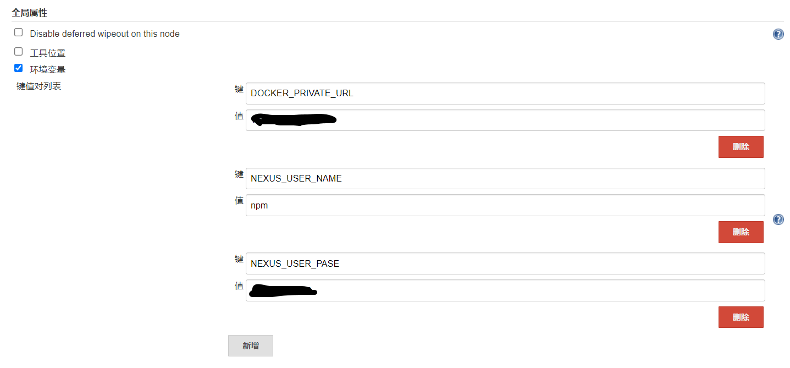

# jenkins服务配置

运行一个jenkins服务，用于微前端服务的部署工作，实现目标是：每个微前端服的每次 CI 跑完后，都会生成一个独立版本的 docker 镜像，在 jenkins obj 中可以按照时间逆序排列，展示微前端服务打包的所有镜像，可以手动选择一个镜像部署到服务器。

app 和 front 都会单独部署成独立的前端服务，此外还需要有个 nginx 独立服务做代理。

front 服务是总项目的入口，如有其他服务请求时，front 服务会访问 nginx 服务，然后根据一级路由代理获得不同 app 服务的支持。


## 实现后效果

Jenkins 任务创建完毕后效果如下


当有 app 模块 ci 跑完，我们选择 app-cd 对应任务，点击构建，选择最新的 docker 版本，即可部署代码到服务器了


## 任务创建

如果还没有安装 jenkins，查看下边有对应文档。

### 添加全局变量

点击系统管理-系统配置-全局属性，添加三个全局变量

DOCKER_PRIVATE_URL // 配置私有源对应地址，例如：192.168.20.101:8089

NEXUS_USER_NAME // 配置私有源用户名

NEXUS_USER_PASE // 配置私有源密码




### remote 模块部署任务配置

app 包和 front 包都可以使用一下配置。

**前提**

安装 jenkins plugin 选择参数组件 [Active Choices](https://plugins.jenkins.io/uno-choice)

**参数创建与配置**

创建任务，选择参数化过程，添加 Active Choices Parameter 选择参数。


然后 name 写入 `Deployed` 用于后续 shell 脚本变量取值。

script 选择 Groovy Script，输入下边内容

```groovy
def imageName = "app1-cd"
def get = new URL("http://192.168.20.100:8081/service/rest/v1/search?docker.imageName=${imageName}&sort=version").openConnection();
def getRC = get.getResponseCode();
println(getRC);
if(getRC.equals(200)) {
  def parser = new groovy.json.JsonSlurper();
  def dataJson = parser.parseText(get.getInputStream().getText());
  def list=dataJson.items.collect { it.version }
}
```

这里 URL 中的地址是 Nexus3 的 api 地址，用于查询一个 docker 镜像的 tag 列表，然后按版本逆序排列，用于我们选择对应版本部署。


**编写shell运行docker**

在“构建”栏添加 shell 构建步骤，然后插入指令

```shell
port=9101
imageName="app1-cd"
docker stop $imageName || true
docker rm $imageName || true
docker rmi `docker images -q $DOCKER_PRIVATE_URL/$imageName` || true
docker pull $DOCKER_PRIVATE_URL/$imageName:$Deployed
docker run -d -p $port:80 --name $imageName $DOCKER_PRIVATE_URL/$imageName:$Deployed
```

### **nginx 代理服务部署任务配置**

配置 nginx 配置文件：`/home/jenkins/95-cd/nginx/conf.d/default.conf `

```nginx
server {
    listen       80;
    server_name  localhost;
    location /app1/ {
	  proxy_pass http://192.168.20.101:9101/;
    }
    location /app2/ {
	  proxy_pass http://192.168.20.123:9102/;
    }
}
```

然后在jenkins中添加任务 95-cd。

在“构建”栏添加 shell 构建步骤，然后插入指令

```shell
imageName="95-cd"
dockerfileDir="/home/jenkins/${imageName}"
cd $dockerfileDir
docker stop $imageName || true
docker rm $imageName || true
docker rmi `docker images -q $imageName` || true
cat > "${dockerfileDir}/Dockerfile" <<EOF
FROM nginx:1.14.2
MAINTAINER wz
COPY ./nginx/ /etc/nginx/
EOF

docker build -f "${dockerfileDir}/Dockerfile" -t $imageName:$imageName .
docker run --name $imageName -d -p 9095:80 --network bridge $imageName:$imageName
```


## 安装

此次教程不使用 docker 部署 jenkins ，而是直接安装到服务上。

### java安装

首先安装java环境

```bash
sudo apt install openjdk-8-jdk-headless
```

> 注意如果报错 Ubuntu20.04安装 JDK-8 缺少Breaks: x11-common
>
> 方案：https://juejin.cn/post/7247342069617410085（需要更换源）

查询java安装的目录

```bash
sudo update-alternatives --config java
```

添加环境变量

```bash
vim /root/.bashrc
# 加上地址，就是上边查到的地址
# export JAVA_HOME=/usr/lib/jvm/java-8-openjdk-amd64
# export CLASSPATH=.:$JAVA_HOME/lib/dt.jar:$JAVA_HOME/lib/tools.jar
# export PATH=$JAVA_HOME/bin:$PATH
```

### jenkins安装

**下载 .war 包**

地址：https://mirrors.jenkins.io/war-stable/

**设置ssh**

切换到一个非 root 用户，例如 jenkins 用户，root 用户使用 jenkins 连接 gitlab 存在问题。

```
su jenkins
```

然后

```bash
# 查看gitlab服务器ssh的类型
ssh -vT git@gitlab.wz.com【你的gitlab地址】
# 查询到下边一句
# debug1: Host 'gitlab.wz.com' is known and matches the ED25519 host key.
# 类型为 ED25519 生成 ssh
ssh-keygen -t ed25519 -C "zhan.wu@163.com"
# 测试是否成功
ssh -T git@gitlab.wz.com
# 复制当前用户 .ssh 到 /root/.ssh 下
```

### docker安装

jenkins 使用时需要用到 docker，服务器内安装docker

```bash
# 先卸载旧版，如果没有的话，就不用执行了，直接第二步。
apt-get remove docker docker-engine docker.io containerd runc
# 在终端输入
apt update
sudo apt-get update
apt-get install ca-certificates curl gnupg lsb-release -y
# 安装证书
curl -fsSL http://mirrors.aliyun.com/docker-ce/linux/ubuntu/gpg | apt-key add -
# 写入软件源信息
sudo add-apt-repository "deb [arch=amd64] http://mirrors.aliyun.com/docker-ce/linux/ubuntu $(lsb_release -cs) stable"

# 安装
sudo apt-get install docker-ce docker-ce-cli containerd.io
# 中途出现问题的话，使用  sudo apt-get update 试试
# 启动docker
systemctl start docker

# 安装工具
apt-get -y install apt-transport-https ca-certificates curl software-properties-common
# 重启docker
service docker restart
# 测试是否成功，输入sudo docker run hello-world 显示以下信息则成功，第一次比较慢。

# 查看docker版本 
sudo docker version
```

**配置镜像源**

新建并编辑`/etc/docker/daemon.json`文件

```bash
sudo mkdir -p /etc/docker
sudo tee /etc/docker/daemon.json <<-'EOF'
{
  "registry-mirrors": [
        "http://192.168.20.131:8089/", # 这个是 Nexus3 搭建的私有库的地址，详情参考 Nexus3 搭建文档。
        "https://r4p7cmbk.mirror.aliyuncs.com",
        "https://8xpk5wnt.mirror.aliyuncs.com",
        "https://dockerhub.azk8s.cn",
        "https://registry.docker-cn.com",
        "https://ot2k4d59.mirror.aliyuncs.com/"
  ],
  "insecure-registries": [ # docker push 私有库地址，详情参考 Nexus3 搭建文档。
    "192.168.20.131:8089"
  ],
  "live-restore": true ,
  "dns": ["114.114.114.114","8.8.8.8","8.8.4.4"]
}

EOF
sudo systemctl daemon-reload
sudo systemctl restart docker
```

### jenkins配置

**第一次启动获取密码**

首先进入目录获取密码

```
vim /root/.jenkins/secrets/initialAdminPassword
```

**获取ssh**

进入 .ssh 目录

```bash
cd ~/.ssh/
```

私钥

```bash
cat id_ed25519
```

公钥钥

```bash
cat id_ed25519.pub
```

**开启服务**

在 jenkins 用户中启动 jenkins。

> 生产环境使用 Tomcat 运行即可。

```bash
java -jar jenkins.war --httpPort=28080
```

## 备注

### docker 中 nginx 不能访问问题

可能是 ubuntu 中 进程没有关闭，导致端口占用，重启服务器可以解决。
