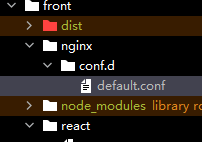

# @microup/front

## 前端启动

### 安装依赖

> 推荐安装 pnpm 作为包管理器，可以更快的升级我们的依赖包。

`npm i -g pnpm`

```pnpm i```

### MAC系统设置权限

```chmod -R 777 node_modules```

### 启动

```pnpm run start```

## 介绍

这是整个项目的 host 模块，生产环境运行时只有 front 会运行 master 代码，在 master 中通过一级路由分发到不同 remote 模块上。

front 包内没有任何业务代码，它只是整个项目的入口服务。

> 生产环境中 utils 包的引入是在 master 包中引入的，但是 master 不会单独起一个服务，他会附着在 front 服务上运行。
>
> ```
>   "devDependencies": {
>     "@microup/boot": ">=1.0.0-main-1.0.0 <1.0.0-main-1.0.1"
>   }
> ```

## .env 常用配置

在 front 的 .env 中配置常量，最终会放入 `window._env_` 中。

注意：因为线上的生产环境入口时 front 服务器，所以 .env 文件会使用 front 的。

```js
API_HOST=https://api.test.microup.com
STATIC_URL=http://192.168.88.132:9095
app1=http://192.168.88.132:9101
app2=http://192.168.88.132:9102
```

## nginx 配置覆盖

在 front、app 包都可以设置 nginx 配置文件，在根目录创建 nginx 目录，通过 ci 覆盖配置到 docker nginx 中。



配置一般如下，通过 `try_files $uri $uri/ /index.html;` 可以配置任何路由都将访问 index.html。实现 `devServerConfig.historyApiFallback: true` 对应功能。

```js
server {
    listen       80;
    server_name  localhost;
    location / {
        root   /usr/share/nginx/html;
        try_files $uri $uri/ /index.html;  # 加上这一行即可
        index  index.html index.htm;
    }
    error_page   500 502 503 504  /50x.html;
    location = /50x.html {
        root   /usr/share/nginx/html;
    }
}

```

